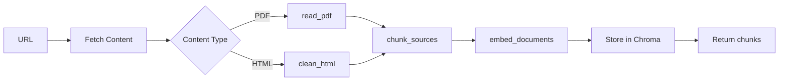

# API Reference

Complete API documentation for all modules in the Thesis Guidance Chat Application.

## Table of Contents

- [DB_Manager](#db_manager)
- [RAG_Chat](#rag_chat)
- [Streamlit App](#streamlit-app)
- [Logger](#logger)

---

## DB_Manager

**Module**: `src/db_manager.py`

The DB_Manager class handles all vector database operations, document processing, and retrieval functionality.

### Class: `DB_Manager`

```python
class DB_Manager:
    """Database Manager for vector database operations and document processing."""
```

#### Constructor

```python
def __init__(
    self,
    config_file: str = "configs/settings.yml"
) -> None
```

**Parameters**:
- `config_file` (str): Path to YAML configuration file

**Raises**:
- `FileNotFoundError`: If configuration file doesn't exist
- `Exception`: If database setup fails

**Example**:
```python
from db_manager import DB_Manager

db = DB_Manager(config_file="configs/settings.yml")
```

---

#### Method: `setup_vector_database`

```python
def setup_vector_database(self) -> None
```

Initialize vector database components and create collection.

**Side Effects**:
- Creates persistence directory if it doesn't exist
- Initializes Ollama embeddings
- Creates or connects to Chroma database
- Sets up document collection

**Raises**:
- `Exception`: If database initialization fails

---

#### Method: `load_and_process_url_content`

```python
def load_and_process_url_content(self, url: str) -> List[str]
```

Load and process content from a URL for vector database storage.

**Parameters**:
- `url` (str): URL to fetch and process

**Returns**:
- `List[str]`: List of processed text chunks

**Raises**:
- `Exception`: If content type is unsupported
- `Exception`: If no chunks are generated
- `sqlite3.OperationalError`: If database operation fails

**Supported Content Types**:
- `application/pdf`: Processed with PyMuPDF
- `text/html`: Cleaned with BeautifulSoup

**Example**:
```python
chunks = db.load_and_process_url_content(
    "https://help.jamk.fi/opinnaytetyo/en/thesis/bachelors-thesis/"
)
print(f"Processed {len(chunks)} chunks")
```

**Processing Pipeline**:



---

#### Method: `retrieve`

```python
def retrieve(self, query: str) -> List[langchain_core.documents.base.Document]
```

Retrieve relevant documents based on similarity search.

**Parameters**:
- `query` (str): Search query for document retrieval

**Returns**:
- `List[Tuple[Document, float]]`: List of (Document, similarity_score) tuples

**Example**:
```python
results = db.retrieve("How to write thesis introduction?")
for doc, score in results:
    print(f"Score: {score:.4f}")
    print(f"Source: {doc.metadata.get('source')}")
    print(f"Content: {doc.page_content[:100]}...")
```

---

#### Method: `read_pdf`

```python
def read_pdf(self, data: bytes) -> List[Dict]
```

Extract text and metadata from PDF documents.

**Parameters**:
- `data` (bytes): Binary content of the PDF file

**Returns**:
- `List[Dict]`: List of dictionaries with format:
  ```python
  [
      {
          "text": "page content...",
          "metadata": {
              "page": 1,
              "source": "url",
              ...
          }
      },
      ...
  ]
  ```

**Raises**:
- `ValueError`: If PDF processing fails or no content extracted
- `Exception`: For other PDF processing errors

---

#### Method: `clean_html`

```python
def clean_html(self, response: requests.Response, url: str) -> str
```

Clean HTML content by removing unwanted elements.

**Parameters**:
- `response` (requests.Response): HTTP response containing HTML
- `url` (str): Source URL for logging

**Returns**:
- `str`: Cleaned text content with normalized whitespace

**Cleaning Process**:
1. Parse HTML with BeautifulSoup
2. Remove tags by name (script, style, header, footer, etc.)
3. Remove elements by class name (navigation, menus, etc.)
4. Extract clean text
5. Normalize whitespace

---

#### Method: `chunk_sources`

```python
def chunk_sources(self, s: str) -> List[str]
```

Split text content into manageable chunks for embedding.

**Parameters**:
- `s` (str): Input text to be chunked

**Returns**:
- `List[str]`: List of text chunks

**Configuration** (from `settings.yml`):
- `chunk_size`: 256 tokens (default)
- `chunk_overlap`: 50 tokens (default)

**Example**:
```python
text = "Long document about thesis writing..."
chunks = db.chunk_sources(text)
print(f"Created {len(chunks)} chunks")
```

---

#### Method: `clean_metadata`

```python
def clean_metadata(self, metadata: Dict[str, Any]) -> Dict[str, Any]
```

Clean and standardize document metadata.

**Parameters**:
- `metadata` (Dict[str, Any]): Raw metadata dictionary

**Returns**:
- `Dict[str, Any]`: Cleaned metadata with None values replaced by empty strings

---

## RAG_Chat

**Module**: `src/chat.py`

The RAG_Chat class extends LangChain's ChatOllama to provide document-grounded responses.

### Class: `RAG_Chat`

```python
class RAG_Chat(ChatOllama):
    """Retrieval-Augmented Generation Chat for Thesis Guidance."""
```

#### Constructor

```python
def __init__(
    self,
    model: Optional[str] = None,
    **kwargs
) -> None
```

**Parameters**:
- `model` (Optional[str]): Ollama model name (default: from config)
- `**kwargs`: Additional arguments for ChatOllama
  - `temperature` (float): Sampling temperature (default: 0.0)
  - `base_url` (str): Ollama API URL (default: "http://localhost:11434")

**Example**:
```python
from chat import RAG_Chat

# Use default model from config
rag_chat = RAG_Chat()

# Specify custom model
rag_chat = RAG_Chat(
    model="llama3.2:latest",
    temperature=0.0
)
```

---

#### Method: `chat`

```python
def chat(
    self,
    content: Union[List[str], str],
    question: str
) -> AIMessage
```

Generate a response based on provided documents and user question.

**Parameters**:
- `content` (Union[List[str], str]): Document content for context
- `question` (str): User's question

**Returns**:
- `AIMessage`: LangChain response object with:
  - `content`: Generated response text
  - `response_metadata`: Model metadata and statistics

**Example**:
```python
documents = [
    "A thesis introduction should provide background...",
    "The introduction typically spans 2-3 pages..."
]
question = "How should I write my thesis introduction?"

response = rag_chat.chat(documents, question)
print(f"Response: {response.content}")
print(f"Model: {response.response_metadata['model']}")
print(f"Tokens: {response.response_metadata['eval_count']}")
```

**Prompt Template**:

The method uses a configurable template from `settings.yml`:

```yaml
chat:
  prompt_template: |
    Answer the question only using the provided Documents.
    Your tasks are to follow these instructions:
        Use ONLY the provided Documents...
        DO NOT invent, assume, or infer information...
    
    Documents: {content}
    Question: {question}
    Answer:
```

---

#### Method: `update_prompt_template`

```python
def update_prompt_template(self, new_template: str) -> None
```

Update the prompt template for this instance.

**Parameters**:
- `new_template` (str): New prompt template with `{content}` and `{question}` placeholders

**Example**:
```python
custom_template = """
Based on these documents: {content}

Answer this question: {question}

Response:
"""
rag_chat.update_prompt_template(custom_template)
```

---

#### Method: `get_default_response`

```python
def get_default_response(self) -> str
```

Get the configured default response for when no information is available.

**Returns**:
- `str`: Default "no information" response from configuration

---

#### Property: `prompt_template`

```python
@property
def prompt_template(self) -> str
```

Get or set the current prompt template.

**Example**:
```python
# Get current template
current = rag_chat.prompt_template

# Set new template
rag_chat.prompt_template = "New template: {content} | {question}"
```

---

## Streamlit App

**Module**: `src/app.py`

Main application interface and orchestration functions.

### Function: `get_vector_database`

```python
def get_vector_database() -> DB_Manager
```

Get or create a vector database instance (singleton pattern).

**Returns**:
- `DB_Manager`: Vector database manager instance

---

### Function: `retrieve_documents`

```python
def retrieve_documents(query: str) -> List[Dict]
```

Retrieve relevant documents based on a query.

**Parameters**:
- `query` (str): Search query

**Returns**:
- `List[Dict]`: List of dictionaries:
  ```python
  [
      {
          "result": Document,
          "score": float
      },
      ...
  ]
  ```

---

### Function: `load_source_dataset`

```python
def load_source_dataset() -> None
```

Load and process thesis guidance documents from configured URLs.

**Side Effects**:
- Updates vector database
- Displays progress in Streamlit UI
- Creates log entries

---

### Function: `store_chat_results`

```python
def store_chat_results(
    duration: float,
    model: str,
    query: str,
    response: str,
    metadata: Dict[str, Any],
    documents: List[str]
) -> None
```

Store chat interaction results to CSV file.

**Parameters**:
- `duration` (float): Response time in seconds
- `model` (str): LLM model name
- `query` (str): User's question
- `response` (str): LLM's response
- `metadata` (Dict[str, Any]): Response metadata
- `documents` (List[str]): Retrieved documents

---

### Function: `chat_with_model`

```python
def chat_with_model(
    documents: List[Dict[str, Any]],
    input_text: str
) -> None
```

Process user query with retrieved documents and display results.

**Parameters**:
- `documents` (List[Dict[str, Any]]): Retrieved documents with scores
- `input_text` (str): User's question

**Side Effects**:
- Displays response in Streamlit UI
- Shows retrieved documents
- Stores results to CSV

---

## Logger

**Module**: `src/tg_logger.py`

Logging configuration and setup.

### Function: `setup_logger`

```python
def setup_logger(
    name: str = "tg_logger",
    config_file: str = "configs/logger_config.yml"
) -> logging.Logger
```

Set up and configure application logger.

**Parameters**:
- `name` (str): Logger name
- `config_file` (str): Path to logger configuration

**Returns**:
- `logging.Logger`: Configured logger instance

**Example**:
```python
from tg_logger import setup_logger

logger = setup_logger()
logger.info("Application started")
logger.debug("Debug information")
logger.error("Error occurred")
```

---

## Data Models

### Document Metadata

Documents stored in Chroma include the following metadata:

```python
{
    "source": str,           # Original URL
    "content-type": str,     # "text/html" or "application/pdf"
    "page": int,            # Page number (PDF only)
    # Additional PDF metadata fields
}
```

### Chat Result Schema

CSV storage format:

| Column | Type | Description |
|--------|------|-------------|
| timestamp | datetime | ISO 8601 timestamp |
| duration | float | Response time (seconds) |
| model | str | LLM model name |
| query | str | User question |
| response | str | LLM response |
| metadata | str | JSON response metadata |
| documents | str | JSON array of documents |

---

## Configuration Reference

See [Configuration Guide](CONFIGURATION.md) for detailed configuration options.

### Key Configuration Sections

```yaml
database:          # Vector DB settings
  persist_directory: "./chroma_db"
  collection_name: "docs"
  ollama_embeddings_model: "mxbai-embed-large"
  chunk_size: 256
  chunk_overlap: 50
  default_k: 3

models:           # LLM configuration
  available_models: ["llama3.2:latest", "phi3:latest", "qwen3:4b"]
  default_model: "llama3.2:latest"

chat:             # RAG settings
  temperature: 0.0
  base_url: "http://localhost:11434"
  prompt_template: "..."
```

---

**Next Steps**: See [User Guide](USER_GUIDE.md) for usage examples and tutorials.

