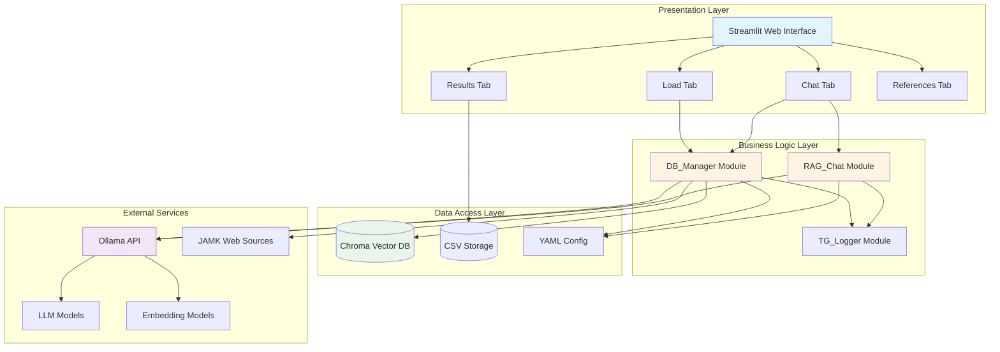
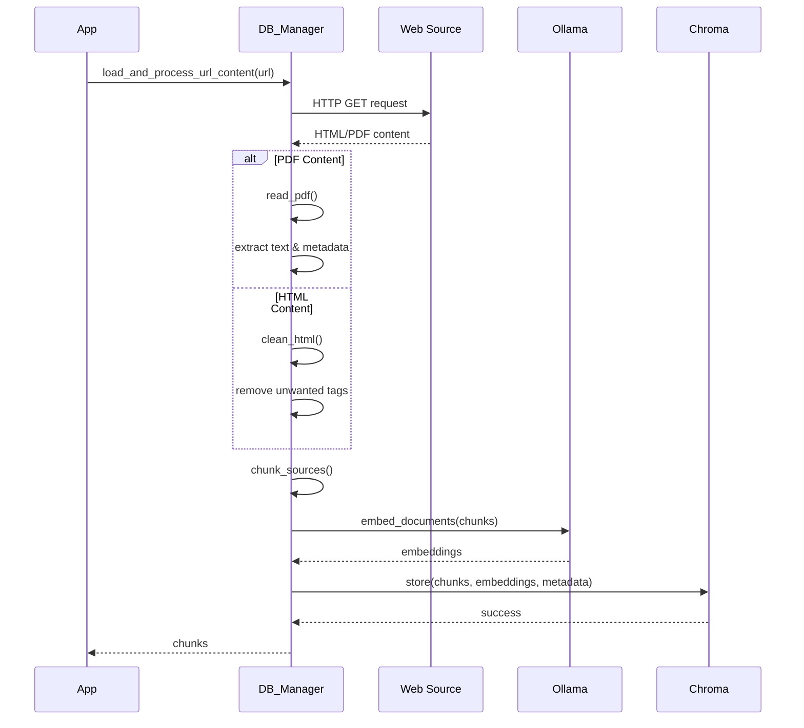
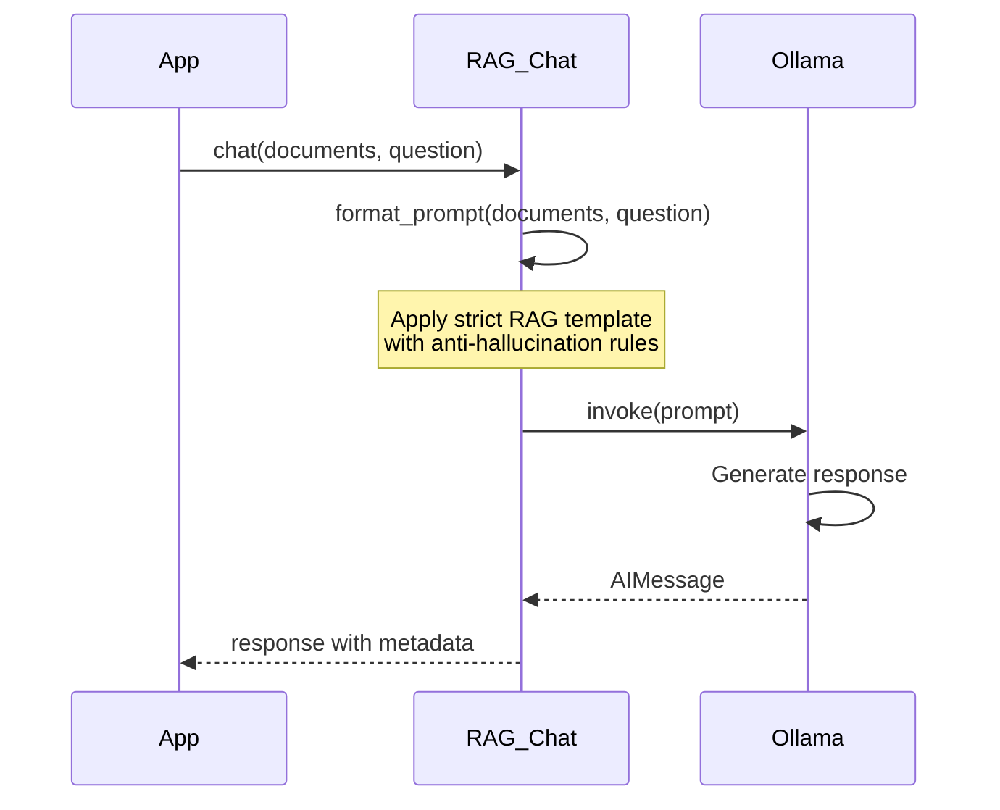
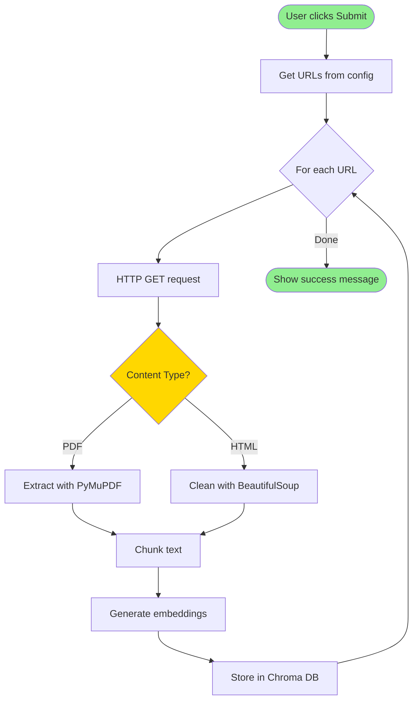
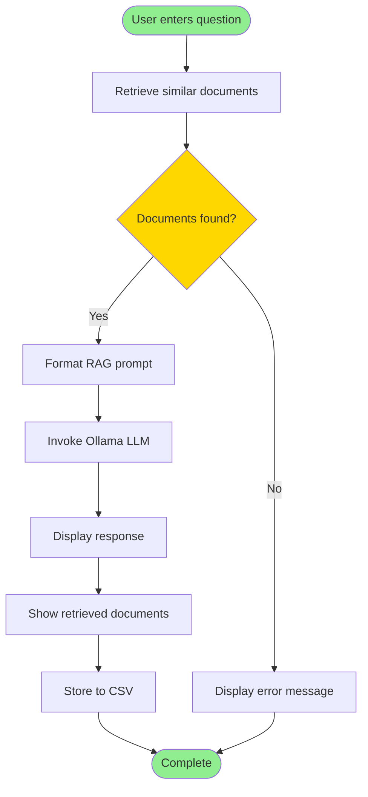
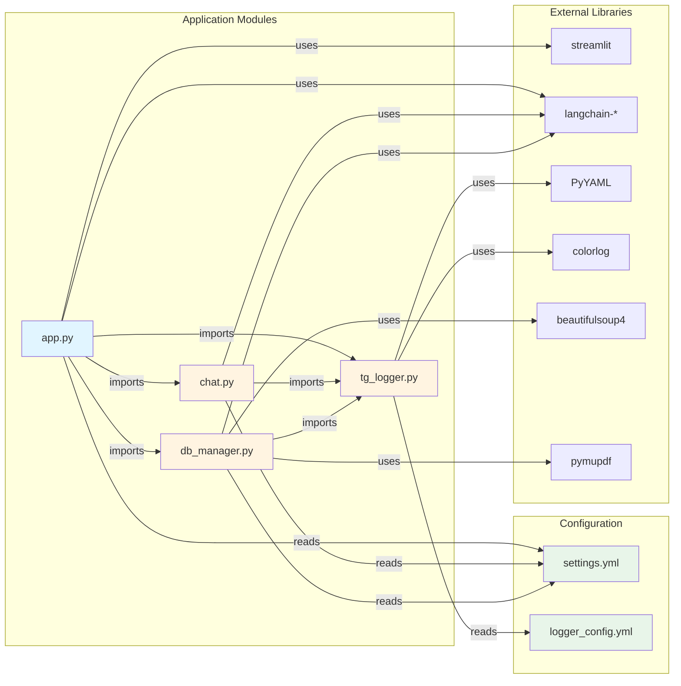

# Architecture Guide

This document provides a comprehensive overview of the Thesis Guidance Chat Application architecture, including system design, component interactions, and data flow.

> **Proof of Concept**: This architecture demonstrates a working RAG implementation for educational purposes. Design decisions prioritize clarity and demonstration of concepts over production-scale optimization.

## Table of Contents

- [System Overview](#system-overview)
- [Architecture Layers](#architecture-layers)
- [Component Details](#component-details)
- [Data Flow](#data-flow)
- [Design Patterns](#design-patterns)
- [Technology Stack](#technology-stack)

## System Overview

The application implements a **Retrieval-Augmented Generation (RAG)** architecture with three distinct layers:



## Architecture Layers

### 1. Presentation Layer (UI)

**Technology**: Streamlit  
**File**: `src/app.py`

The presentation layer provides a web-based interface with four main sections:

#### Load Tab
- Displays list of configured JAMK URLs
- Provides "Submit" button to trigger document loading
- Shows progress bar and real-time URL processing status
- Handles loading errors gracefully

#### Chat Tab
- Text input for user questions
- Submit button to trigger RAG pipeline
- Displays LLM responses with metadata
- Shows retrieved documents with relevance scores
- Stores chat results to CSV

#### Results Tab
- Displays DataFrame of all chat sessions
- Shows timestamp, model, query, response, metadata, and documents
- Provides filtering and sorting capabilities

#### References Tab
- Static page with documentation links
- JAMK thesis guidance resources
- Technical documentation references

### 2. Business Logic Layer

#### DB_Manager (`src/db_manager.py`)

**Responsibilities**:
- Document loading and processing
- Vector database management
- Embedding generation
- Similarity search

**Key Methods**:

```python
class DB_Manager:
    def __init__(config_file: str)
    def setup_vector_database() -> None
    def load_and_process_url_content(url: str) -> List[str]
    def retrieve(query: str) -> List[Document]
    def read_pdf(data: bytes) -> List[Dict]
    def clean_html(response: Response, url: str) -> str
    def chunk_sources(text: str) -> List[str]
```

**Processing Pipeline**:



#### RAG_Chat (`src/chat.py`)

**Responsibilities**:
- LLM interaction management
- Prompt engineering
- Response generation
- Context adherence enforcement

**Key Methods**:

```python
class RAG_Chat(ChatOllama):
    def __init__(model: str, **kwargs)
    def chat(content: List[str], question: str) -> AIMessage
    def update_prompt_template(new_template: str) -> None
    def get_default_response() -> str
```

**Chat Flow**:



### 3. Data Access Layer

#### Chroma Vector Database

**Location**: `./chroma_db/`  
**Collection**: Configured in `settings.yml` (default: "docs")

**Schema**:
- **Documents**: Text chunks from processed sources
- **Embeddings**: Vector representations (mxbai-embed-large)
- **Metadata**: 
  - `source`: Original URL
  - `content-type`: "text/html" or "application/pdf"
  - `page`: Page number (for PDFs)
  - Additional PDF metadata

**Operations**:
- `add()`: Store documents with embeddings
- `similarity_search_with_score()`: Retrieve relevant documents

#### CSV Storage

**Location**: `./chat_session_records/chat_results.csv`

**Schema**:
```csv
timestamp,duration,model,query,response,metadata,documents
```

**Columns**:
- `timestamp`: ISO 8601 datetime
- `duration`: Response time in seconds
- `model`: LLM model name
- `query`: User question
- `response`: LLM response content
- `metadata`: JSON response metadata
- `documents`: JSON array of retrieved documents

## Data Flow

### Document Loading Flow



### Chat Interaction Flow



## Design Patterns

### 1. Singleton Pattern

**Usage**: Vector database management in Streamlit session state

```python
def get_vector_database() -> DB_Manager:
    if VECTOR_DATABASE not in st.session_state:
        db_manager = DB_Manager(config_file=DEFAULT_CONFIG_FILE)
        st.session_state[VECTOR_DATABASE] = db_manager
    return st.session_state[VECTOR_DATABASE]
```

**Benefits**:
- Single database instance per session
- Prevents redundant initialization
- Maintains state across Streamlit reruns

### 2. Template Method Pattern

**Usage**: Configurable prompt templates in RAG_Chat

```python
prompt = self.prompt_template.format(content=content, question=question)
```

**Benefits**:
- Flexible prompt engineering
- Easy A/B testing of prompts
- Runtime template updates

### 3. Strategy Pattern

**Usage**: Content processing strategies (HTML vs PDF)

```python
if content_type == "application/pdf":
    md_text = self.read_pdf(response.content)
elif content_type.startswith("text/html"):
    cleared_text = self.clean_html(response, url)
```

**Benefits**:
- Extensible to new content types
- Isolated processing logic
- Easy to test independently

### 4. Repository Pattern

**Usage**: DB_Manager abstracts vector database operations

```python
class DB_Manager:
    def retrieve(self, query: str) -> List[Document]:
        # Abstracts Chroma implementation details
        return self.vector_database.similarity_search_with_score(query, k=self.config["database"]["default_k"])
```

**Benefits**:
- Decouples business logic from data access
- Easy to swap vector database implementations
- Simplified testing with mocks

## Technology Stack

### Core Technologies

| Component | Technology | Version | Purpose |
|-----------|-----------|---------|---------|
| **UI Framework** | Streamlit | Latest | Web interface |
| **LLM Framework** | LangChain | Latest | RAG orchestration |
| **Vector DB** | Chroma | Latest | Document storage & retrieval |
| **LLM Service** | Ollama | Latest | Local LLM inference |
| **Embeddings** | mxbai-embed-large | Latest | Text vectorization |
| **PDF Processing** | PyMuPDF | Latest | PDF text extraction |
| **HTML Processing** | BeautifulSoup4 | Latest | HTML cleaning |
| **Text Splitting** | SentenceTransformers | Latest | Semantic chunking |

### Module Dependencies

#### Internal Module Imports



**Import Hierarchy**:
1. **tg_logger.py** (No internal dependencies)
   - Imports: `logging`, `yaml`, `colorlog`
   - Reads: `logger_config.yml`

2. **chat.py** (Depends on: tg_logger)
   - Imports: `tg_logger`, `langchain_ollama`, `yaml`
   - Reads: `settings.yml`

3. **db_manager.py** (Depends on: tg_logger)
   - Imports: `tg_logger`, `langchain_chroma`, `langchain_ollama`, `langchain_text_splitters`, `beautifulsoup4`, `pymupdf`, `yaml`
   - Reads: `settings.yml`

4. **app.py** (Depends on: chat, db_manager, tg_logger)
   - Imports: `chat`, `db_manager`, `tg_logger`, `streamlit`, `langchain_ollama`, `pandas`, `yaml`
   - Reads: `settings.yml`

### Python Dependencies

See `requirements.txt` for complete list:

**Core Framework**:
- `langchain-core`: Core LangChain functionality
- `langchain-chroma`: Chroma vector store integration
- `langchain-ollama`: Ollama LLM integration
- `langchain-text-splitters`: Text chunking utilities

**Document Processing**:
- `beautifulsoup4`: HTML parsing and cleaning
- `pymupdf`: PDF text extraction
- `pymupdf4llm`: LLM-optimized PDF processing
- `sentence-transformers`: Semantic text splitting

**Configuration & Logging**:
- `PyYAML`: Configuration file management
- `colorlog`: Enhanced colorized logging

**Web Interface**:
- `streamlit`: Web UI framework (installed separately)
- `pandas`: Data manipulation for results display

### External Services

- **Ollama**: Local LLM inference server (port 11434)
- **JAMK Web Sources**: Thesis guidance documentation

## Configuration Architecture

All configuration is centralized in `configs/settings.yml`:

```yaml
database:         # Vector DB settings
app:              # Streamlit UI settings
models:           # LLM model configuration
data_sources:     # URLs to load
network:          # HTTP settings
source_loader:    # HTML cleaning rules
storage:          # CSV storage paths
ui:               # UI messages and display
chat:             # RAG prompt templates
```

**Benefits**:
- Single source of truth
- Environment-specific configs
- No hardcoded values
- Easy deployment customization

## Scalability Considerations

### Current Limitations

- **Single-user**: Streamlit session-based state
- **Local LLM**: Ollama runs on same machine
- **Synchronous**: Sequential document processing
- **In-memory**: Limited by available RAM

### Future Enhancements

1. **Multi-user Support**: Deploy with proper session management
2. **Distributed Processing**: Async document loading with task queue
3. **Remote LLM**: Support for API-based LLMs (OpenAI, Anthropic)
4. **Caching**: Redis for frequently accessed documents
5. **Monitoring**: Prometheus metrics and Grafana dashboards

---

**Next Steps**: See [API Reference](API.md) for detailed method documentation.

