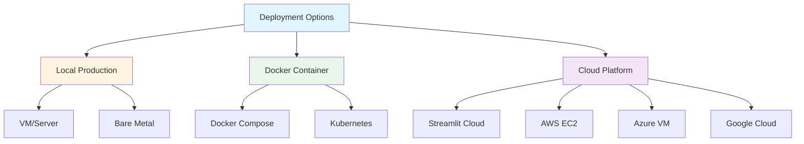

# Deployment Guide

Guide for deploying the Thesis Guidance Chat Application to various environments.

> **Proof of Concept Notice**: This is a PoC application. The deployment instructions are provided for demonstration and testing purposes. For production use, additional security hardening, scalability considerations, and compliance requirements should be addressed.

## Table of Contents

- [Deployment Options](#deployment-options)
- [Local Production Deployment](#local-production-deployment)
- [Docker Deployment](#docker-deployment)
- [Cloud Deployment](#cloud-deployment)
- [Security Considerations](#security-considerations)
- [Monitoring and Maintenance](#monitoring-and-maintenance)
- [Backup and Recovery](#backup-and-recovery)

## Deployment Options



## Local Production Deployment

### Prerequisites

- Ubuntu 20.04+ or similar Linux distribution
- Python 3.12+
- Ollama installed
- Systemd for service management
- Nginx for reverse proxy (optional)

### Step 1: System Setup

```bash
# Update system
sudo apt update && sudo apt upgrade -y

# Install Python and dependencies
sudo apt install -y python3.12 python3.12-venv python3-pip

# Install Ollama
curl -fsSL https://ollama.ai/install.sh | sh

# Start Ollama service
sudo systemctl enable ollama
sudo systemctl start ollama
```

### Step 2: Application Setup

```bash
# Create application user
sudo useradd -m -s /bin/bash ragchat
sudo su - ragchat

# Clone repository
git clone https://github.com/jv-mt/rag_chat.git
cd rag_chat

# Install uv
curl -LsSf https://astral.sh/uv/install.sh | sh
source ~/.bashrc

# Create virtual environment
uv venv
source .venv/bin/activate

# Install dependencies
uv pip install -r requirements.txt

# Pull Ollama models
ollama pull llama3.2:latest
ollama pull mxbai-embed-large
```

### Step 3: Configuration

```bash
# Create production config
cp configs/settings.yml configs/settings.prod.yml

# Edit production settings
nano configs/settings.prod.yml
```

**Production Configuration**:
```yaml
# configs/settings.prod.yml
database:
  persist_directory: "/var/lib/ragchat/chroma_db"
  chunk_size: 256
  default_k: 3

storage:
  results_directory: "/var/lib/ragchat/results"

chat:
  logging:
    log_prompt_length: false
    log_model_info: false
    log_input_params: false
```

### Step 4: Systemd Service

Create service file:

```bash
sudo nano /etc/systemd/system/ragchat.service
```

**Service Configuration**:
```ini
[Unit]
Description=RAG Chat Application
After=network.target ollama.service
Requires=ollama.service

[Service]
Type=simple
User=ragchat
Group=ragchat
WorkingDirectory=/home/ragchat/rag_chat
Environment="PATH=/home/ragchat/rag_chat/.venv/bin"
Environment="APP_ENV=prod"
ExecStart=/home/ragchat/rag_chat/.venv/bin/streamlit run src/app.py --server.port=8501 --server.address=0.0.0.0
Restart=always
RestartSec=10

[Install]
WantedBy=multi-user.target
```

**Enable and Start Service**:
```bash
sudo systemctl daemon-reload
sudo systemctl enable ragchat
sudo systemctl start ragchat
sudo systemctl status ragchat
```

### Step 5: Nginx Reverse Proxy (Optional)

```bash
sudo apt install -y nginx

sudo nano /etc/nginx/sites-available/ragchat
```

**Nginx Configuration**:
```nginx
server {
    listen 80;
    server_name your-domain.com;

    location / {
        proxy_pass http://localhost:8501;
        proxy_http_version 1.1;
        proxy_set_header Upgrade $http_upgrade;
        proxy_set_header Connection "upgrade";
        proxy_set_header Host $host;
        proxy_set_header X-Real-IP $remote_addr;
        proxy_set_header X-Forwarded-For $proxy_add_x_forwarded_for;
        proxy_set_header X-Forwarded-Proto $scheme;
        proxy_read_timeout 86400;
    }
}
```

**Enable Site**:
```bash
sudo ln -s /etc/nginx/sites-available/ragchat /etc/nginx/sites-enabled/
sudo nginx -t
sudo systemctl restart nginx
```

### Step 6: SSL with Let's Encrypt

```bash
sudo apt install -y certbot python3-certbot-nginx
sudo certbot --nginx -d your-domain.com
```

## Docker Deployment

### Dockerfile

Create `Dockerfile`:

```dockerfile
FROM python:3.12-slim

# Install system dependencies
RUN apt-get update && apt-get install -y \
    curl \
    && rm -rf /var/lib/apt/lists/*

# Install Ollama
RUN curl -fsSL https://ollama.ai/install.sh | sh

# Set working directory
WORKDIR /app

# Copy application files
COPY requirements.txt .
COPY src/ ./src/
COPY configs/ ./configs/

# Install Python dependencies
RUN pip install --no-cache-dir -r requirements.txt

# Create directories
RUN mkdir -p /app/chroma_db /app/chat_session_records /app/logs

# Expose Streamlit port
EXPOSE 8501

# Expose Ollama port
EXPOSE 11434

# Start script
COPY docker-entrypoint.sh /
RUN chmod +x /docker-entrypoint.sh

ENTRYPOINT ["/docker-entrypoint.sh"]
```

### Docker Entrypoint

Create `docker-entrypoint.sh`:

```bash
#!/bin/bash
set -e

# Start Ollama in background
ollama serve &

# Wait for Ollama to be ready
sleep 5

# Pull required models
ollama pull llama3.2:latest
ollama pull mxbai-embed-large

# Start Streamlit
streamlit run src/app.py --server.port=8501 --server.address=0.0.0.0
```

### Docker Compose

Create `docker-compose.yml`:

```yaml
version: '3.8'

services:
  ragchat:
    build: .
    ports:
      - "8501:8501"
      - "11434:11434"
    volumes:
      - ./chroma_db:/app/chroma_db
      - ./chat_session_records:/app/chat_session_records
      - ./logs:/app/logs
      - ./configs:/app/configs
    environment:
      - APP_ENV=production
    restart: unless-stopped
    healthcheck:
      test: ["CMD", "curl", "-f", "http://localhost:8501"]
      interval: 30s
      timeout: 10s
      retries: 3
```

### Build and Run

```bash
# Build image
docker-compose build

# Start services
docker-compose up -d

# View logs
docker-compose logs -f

# Stop services
docker-compose down
```

## Cloud Deployment

### AWS EC2 Deployment

**1. Launch EC2 Instance**:
- AMI: Ubuntu 22.04 LTS
- Instance Type: t3.large (minimum)
- Storage: 50 GB gp3
- Security Group: Allow ports 22, 80, 443, 8501

**2. Connect and Setup**:
```bash
ssh -i your-key.pem ubuntu@your-ec2-ip

# Follow Local Production Deployment steps
```

**3. Configure Security Group**:
```bash
# Allow HTTP/HTTPS
aws ec2 authorize-security-group-ingress \
    --group-id sg-xxxxx \
    --protocol tcp \
    --port 80 \
    --cidr 0.0.0.0/0

aws ec2 authorize-security-group-ingress \
    --group-id sg-xxxxx \
    --protocol tcp \
    --port 443 \
    --cidr 0.0.0.0/0
```

### Streamlit Cloud Deployment

**Note**: Streamlit Cloud doesn't support Ollama. You'll need to:
1. Use external LLM API (OpenAI, Anthropic)
2. Or deploy Ollama separately and connect via API

**Deployment Steps**:
1. Push code to GitHub
2. Go to [share.streamlit.io](https://share.streamlit.io)
3. Connect repository
4. Configure secrets in Streamlit Cloud dashboard
5. Deploy

**Secrets Configuration**:
```toml
# .streamlit/secrets.toml
[ollama]
base_url = "https://your-ollama-server.com"

[database]
persist_directory = "/mount/chroma_db"
```

### Azure VM Deployment

Similar to AWS EC2:
1. Create Ubuntu VM
2. Configure Network Security Group
3. Follow Local Production Deployment steps

### Google Cloud Platform

```bash
# Create VM instance
gcloud compute instances create ragchat-vm \
    --image-family=ubuntu-2204-lts \
    --image-project=ubuntu-os-cloud \
    --machine-type=n1-standard-2 \
    --boot-disk-size=50GB

# SSH into instance
gcloud compute ssh ragchat-vm

# Follow Local Production Deployment steps
```

## Security Considerations

### Authentication

**Add Basic Auth with Streamlit**:

```python
# src/auth.py
import streamlit as st
import hashlib

def check_password():
    """Returns `True` if the user had the correct password."""
    
    def password_entered():
        """Checks whether a password entered by the user is correct."""
        if hashlib.sha256(st.session_state["password"].encode()).hexdigest() == st.secrets["password_hash"]:
            st.session_state["password_correct"] = True
            del st.session_state["password"]
        else:
            st.session_state["password_correct"] = False

    if "password_correct" not in st.session_state:
        st.text_input("Password", type="password", on_change=password_entered, key="password")
        return False
    elif not st.session_state["password_correct"]:
        st.text_input("Password", type="password", on_change=password_entered, key="password")
        st.error("😕 Password incorrect")
        return False
    else:
        return True

# In app.py
from auth import check_password

if not check_password():
    st.stop()
```

### Firewall Configuration

```bash
# UFW firewall
sudo ufw allow 22/tcp
sudo ufw allow 80/tcp
sudo ufw allow 443/tcp
sudo ufw enable
```

### Environment Variables

```bash
# Store secrets in environment
export OLLAMA_API_KEY="your-api-key"
export DB_PASSWORD="your-db-password"

# Load in application
import os
api_key = os.getenv("OLLAMA_API_KEY")
```

### HTTPS Only

Force HTTPS in Nginx:

```nginx
server {
    listen 80;
    server_name your-domain.com;
    return 301 https://$server_name$request_uri;
}

server {
    listen 443 ssl http2;
    server_name your-domain.com;
    
    ssl_certificate /etc/letsencrypt/live/your-domain.com/fullchain.pem;
    ssl_certificate_key /etc/letsencrypt/live/your-domain.com/privkey.pem;
    
    # ... rest of config
}
```

## Monitoring and Maintenance

### Application Monitoring

**Systemd Logs**:
```bash
# View service logs
sudo journalctl -u ragchat -f

# Last 100 lines
sudo journalctl -u ragchat -n 100
```

**Application Logs**:
```bash
# View application logs
tail -f /home/ragchat/rag_chat/logs/tg_logger_*.log
```

### Health Checks

Create `scripts/health_check.sh`:

```bash
#!/bin/bash

# Check if service is running
if ! systemctl is-active --quiet ragchat; then
    echo "ERROR: RAG Chat service is not running"
    exit 1
fi

# Check if Ollama is responding
if ! curl -s http://localhost:11434/api/tags > /dev/null; then
    echo "ERROR: Ollama is not responding"
    exit 1
fi

# Check if Streamlit is responding
if ! curl -s http://localhost:8501 > /dev/null; then
    echo "ERROR: Streamlit is not responding"
    exit 1
fi

echo "OK: All services healthy"
exit 0
```

**Cron Job**:
```bash
# Add to crontab
*/5 * * * * /home/ragchat/rag_chat/scripts/health_check.sh || systemctl restart ragchat
```

### Resource Monitoring

```bash
# Install monitoring tools
sudo apt install -y htop iotop

# Monitor resources
htop

# Check disk usage
df -h

# Check vector database size
du -sh /var/lib/ragchat/chroma_db
```

### Log Rotation

Create `/etc/logrotate.d/ragchat`:

```
/home/ragchat/rag_chat/logs/*.log {
    daily
    rotate 7
    compress
    delaycompress
    missingok
    notifempty
    create 0644 ragchat ragchat
}
```

## Backup and Recovery

### Backup Strategy

**What to Backup**:
1. Vector database (`chroma_db/`)
2. Chat results (`chat_session_records/`)
3. Configuration files (`configs/`)

**Backup Script** (`scripts/backup.sh`):

```bash
#!/bin/bash

BACKUP_DIR="/backup/ragchat"
DATE=$(date +%Y%m%d_%H%M%S)
BACKUP_FILE="ragchat_backup_${DATE}.tar.gz"

# Create backup directory
mkdir -p $BACKUP_DIR

# Backup files
tar -czf $BACKUP_DIR/$BACKUP_FILE \
    /var/lib/ragchat/chroma_db \
    /var/lib/ragchat/results \
    /home/ragchat/rag_chat/configs

# Keep only last 7 backups
find $BACKUP_DIR -name "ragchat_backup_*.tar.gz" -mtime +7 -delete

echo "Backup completed: $BACKUP_FILE"
```

**Automated Backups**:
```bash
# Daily backup at 2 AM
0 2 * * * /home/ragchat/rag_chat/scripts/backup.sh
```

### Recovery

```bash
# Stop service
sudo systemctl stop ragchat

# Restore from backup
tar -xzf /backup/ragchat/ragchat_backup_20251029_020000.tar.gz -C /

# Start service
sudo systemctl start ragchat
```

### Disaster Recovery Plan

1. **Database Corruption**: Restore from latest backup, reload documents
2. **Service Failure**: Check logs, restart service, verify Ollama
3. **Data Loss**: Restore from backup, verify integrity
4. **Complete System Failure**: Rebuild from infrastructure as code

---

**Production Checklist**:
- [ ] Ollama service running and enabled
- [ ] Application service configured and running
- [ ] Reverse proxy configured (if applicable)
- [ ] SSL certificate installed
- [ ] Firewall configured
- [ ] Monitoring setup
- [ ] Backup automation configured
- [ ] Health checks in place
- [ ] Documentation updated
- [ ] Disaster recovery plan tested

