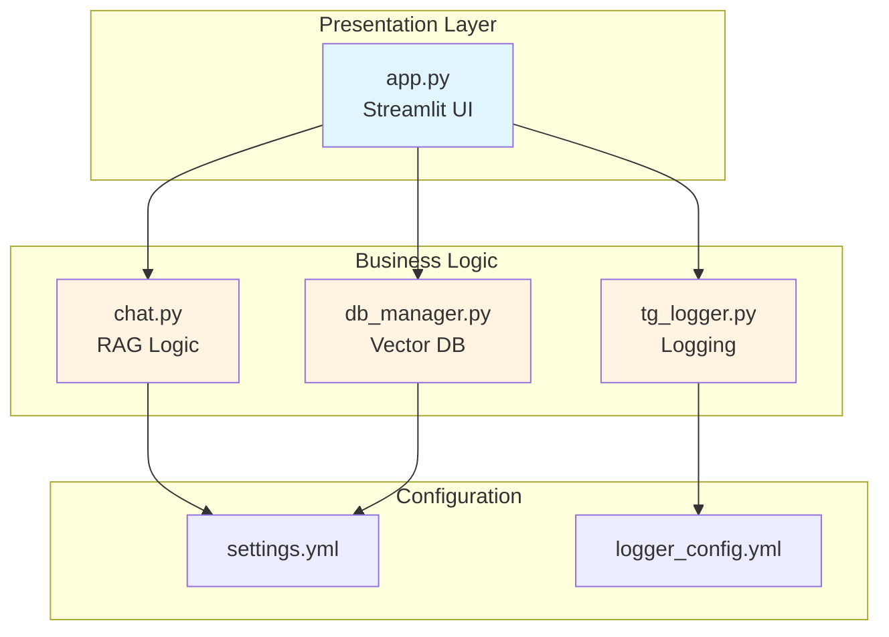
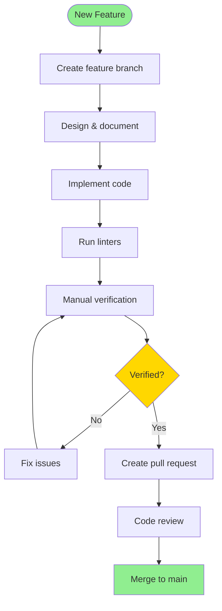

# Development Guide

Guide for developers contributing to the Thesis Guidance Chat Application.

> **Proof of Concept**: This project is a PoC demonstrating RAG technology for thesis guidance. Contributions should focus on improving the demonstration value and educational clarity of the implementation.

## Table of Contents

- [Development Setup](#development-setup)
- [Project Structure](#project-structure)
- [Code Style](#code-style)
- [Adding Features](#adding-features)
- [Debugging](#debugging)
- [Contributing](#contributing)

> **Note**: This PoC does not include automated tests. For production use, comprehensive test coverage would be essential.

## Development Setup

### Prerequisites

- Python 3.12 or higher
- Git
- [uv](https://github.com/astral-sh/uv) package manager
- [Ollama](https://ollama.ai/)

### Initial Setup

1. **Clone Repository**
   ```bash
   git clone https://github.com/jv-mt/rag_chat.git
   cd rag_chat
   ```

2. **Install uv**
   ```bash
   curl -LsSf https://astral.sh/uv/install.sh | sh
   ```

3. **Create Virtual Environment**
   ```bash
   uv venv
   source .venv/bin/activate  # Linux/macOS
   # .venv\Scripts\activate   # Windows
   ```

4. **Install Dependencies**
   ```bash
   uv pip install -r requirements.txt
   ```

5. **Install Development Dependencies**
   ```bash
   uv pip install black flake8 mypy
   ```

6. **Install Ollama Models**
   ```bash
   ollama pull llama3.2:latest
   ollama pull phi3:latest
   ollama pull mxbai-embed-large
   ```

7. **Verify Setup**
   ```bash
   python src/run_module_checks.py
   ```

### Development Environment

**Recommended IDE**: VS Code with extensions:
- Python
- Pylance
- Black Formatter
- YAML

**VS Code Settings** (`.vscode/settings.json`):
```json
{
  "python.linting.enabled": true,
  "python.linting.flake8Enabled": true,
  "python.formatting.provider": "black",
  "python.formatting.blackArgs": ["--line-length", "88"],
  "editor.formatOnSave": true,
  "python.analysis.typeCheckingMode": "basic"
}
```

## Project Structure

```
rag_chat/
├── src/                          # Source code
│   ├── app.py                   # Streamlit UI (main entry)
│   ├── chat.py                  # RAG chat logic
│   ├── db_manager.py            # Vector DB management
│   ├── tg_logger.py             # Logging setup
│   └── run_module_checks.py    # Module verification
├── configs/                      # Configuration
│   ├── settings.yml             # App configuration
│   └── logger_config.yml        # Logging config
├── docs/                         # Documentation
│   ├── README.md                # Main docs
│   ├── ARCHITECTURE.md          # Architecture
│   ├── API.md                   # API reference
│   ├── CONFIGURATION.md         # Config guide
│   ├── USER_GUIDE.md            # User guide
│   ├── DEVELOPMENT.md           # This file
│   └── DEPLOYMENT.md            # Deployment guide
├── chroma_db/                    # Vector database (gitignored)
├── chat_session_records/         # Chat history (gitignored)
├── logs/                         # Application logs (gitignored)
├── requirements.txt              # Python dependencies
├── .gitignore                    # Git ignore rules
├── LICENSE                       # MIT license
└── README.md                     # Project README
```

### Module Responsibilities



## Code Style

### Python Style Guide

Follow [PEP 8](https://pep8.org/) with these specifics:

**Line Length**: 88 characters (Black default)

**Imports**:
```python
# Standard library
import os
import sys
from typing import List, Dict, Any

# Third-party
import yaml
import streamlit as st
from langchain_ollama import ChatOllama

# Local
from db_manager import DB_Manager
from tg_logger import setup_logger
```

**Docstrings**: Google style
```python
def retrieve_documents(query: str) -> List[Dict]:
    """
    Retrieve relevant documents based on a query.

    Args:
        query (str): Search query for document retrieval

    Returns:
        List[Dict]: List of dictionaries containing retrieved documents and scores
                   Format: [{"result": Document, "score": float}, ...]

    Raises:
        ValueError: If query is empty
        Exception: If retrieval fails

    Example:
        >>> docs = retrieve_documents("How to write thesis introduction?")
        >>> for doc in docs:
        ...     print(f"Score: {doc['score']}")
    """
```

**Type Hints**: Always use
```python
from typing import List, Dict, Optional, Union

def process_chunks(
    chunks: List[str],
    metadata: Optional[Dict[str, Any]] = None
) -> List[Document]:
    """Process text chunks into documents."""
    pass
```

### Formatting

**Black** for code formatting:
```bash
# Format all files
black src/

# Check without modifying
black --check src/

# Format specific file
black src/app.py
```

**Flake8** for linting:
```bash
# Lint all files
flake8 src/

# With specific rules
flake8 --max-line-length=88 --extend-ignore=E203 src/
```

**Configuration** (`.flake8`):
```ini
[flake8]
max-line-length = 88
extend-ignore = E203, W503
exclude = .git,__pycache__,.venv
```

### Type Checking

**mypy** for static type checking:
```bash
# Check all files
mypy src/

# Strict mode
mypy --strict src/
```

**Configuration** (`mypy.ini`):
```ini
[mypy]
python_version = 3.12
warn_return_any = True
warn_unused_configs = True
disallow_untyped_defs = True
```

## Adding Features

### Feature Development Workflow



> **Note**: As a PoC, this project does not include automated tests. Features should be manually verified before merging.

### Example: Adding New Content Type

**1. Update DB_Manager**:
```python
# src/db_manager.py

def load_and_process_url_content(self, url: str) -> List[str]:
    """Load and process content from a URL."""
    with requests.get(url, timeout=30) as response:
        content_type = response.headers.get("Content-Type", "")
        
        if content_type == "application/pdf":
            # Existing PDF handling
            pass
        elif content_type.startswith("text/html"):
            # Existing HTML handling
            pass
        elif content_type == "application/vnd.openxmlformats-officedocument.wordprocessingml.document":
            # NEW: Word document handling
            chunks = self.read_docx(response.content)
            metadatas = [{"source": str(url)} for _ in chunks]
        else:
            raise Exception(f"Unsupported content type: {content_type}")

def read_docx(self, data: bytes) -> List[str]:
    """
    Extract text from Word documents.
    
    Args:
        data (bytes): Binary content of DOCX file
    
    Returns:
        List[str]: Extracted text chunks
    """
    import docx
    doc = docx.Document(io.BytesIO(data))
    text = "\n".join([para.text for para in doc.paragraphs])
    return self.chunk_sources(text)
```

**2. Update Documentation**:
```markdown
# docs/API.md

### Supported Content Types

- `application/pdf`: PDF documents
- `text/html`: HTML web pages
- `application/vnd.openxmlformats-officedocument.wordprocessingml.document`: Word documents (NEW)
```

**3. Update Requirements**:
```txt
# requirements.txt
python-docx
```

### Example: Adding New LLM Provider

**1. Create Provider Class**:
```python
# src/llm_providers.py

from abc import ABC, abstractmethod
from typing import Any

class LLMProvider(ABC):
    """Abstract base class for LLM providers."""
    
    @abstractmethod
    def chat(self, prompt: str) -> str:
        """Generate chat response."""
        pass

class OllamaProvider(LLMProvider):
    """Ollama LLM provider."""
    
    def __init__(self, model: str):
        from langchain_ollama import ChatOllama
        self.llm = ChatOllama(model=model)
    
    def chat(self, prompt: str) -> str:
        response = self.llm.invoke(prompt)
        return response.content

class OpenAIProvider(LLMProvider):
    """OpenAI LLM provider."""
    
    def __init__(self, model: str, api_key: str):
        from langchain_openai import ChatOpenAI
        self.llm = ChatOpenAI(model=model, api_key=api_key)
    
    def chat(self, prompt: str) -> str:
        response = self.llm.invoke(prompt)
        return response.content
```

**2. Update RAG_Chat**:
```python
# src/chat.py

class RAG_Chat:
    def __init__(self, provider: LLMProvider):
        self.provider = provider
    
    def chat(self, content: List[str], question: str) -> str:
        prompt = self.prompt_template.format(
            content=content,
            question=question
        )
        return self.provider.chat(prompt)
```

## Debugging

### Logging

**Enable Debug Logging**:
```yaml
# configs/logger_config.yml
version: 1
handlers:
  console:
    level: DEBUG  # Change from INFO
```

**Add Debug Statements**:
```python
from tg_logger import setup_logger

logger = setup_logger()

def my_function(data):
    logger.debug(f"Processing data: {data}")
    logger.info("Function started")
    try:
        result = process(data)
        logger.debug(f"Result: {result}")
        return result
    except Exception as e:
        logger.error(f"Error: {e}", exc_info=True)
        raise
```

### Streamlit Debugging

**View Session State**:
```python
# Add to app.py for debugging
st.sidebar.write("Debug Info")
st.sidebar.json(dict(st.session_state))
```

**Disable Caching**:
```python
# Temporarily disable for debugging
# @st.cache_data
def expensive_function():
    pass
```

### Vector Database Inspection

```python
# scripts/inspect_db.py
from langchain_chroma import Chroma
from langchain_ollama import OllamaEmbeddings

embeddings = OllamaEmbeddings(model="mxbai-embed-large")
db = Chroma(
    collection_name="docs",
    persist_directory="./chroma_db",
    embedding_function=embeddings
)

# Get collection stats
collection = db._client.get_collection("docs")
print(f"Total documents: {collection.count()}")

# Sample documents
results = db.similarity_search("thesis", k=5)
for i, doc in enumerate(results):
    print(f"\n--- Document {i+1} ---")
    print(f"Source: {doc.metadata.get('source')}")
    print(f"Content: {doc.page_content[:200]}...")
```

## Contributing

### Contribution Workflow

1. **Fork Repository**
2. **Create Feature Branch**
   ```bash
   git checkout -b feature/your-feature-name
   ```

3. **Make Changes**
   - Write code
   - Add tests
   - Update documentation

4. **Run Quality Checks**
   ```bash
   # Format code
   black src/

   # Lint
   flake8 src/

   # Type check
   mypy src/

   # Manually verify functionality
   streamlit run src/app.py
   ```

5. **Commit Changes**
   ```bash
   git add .
   git commit -m "feat: add new feature description"
   ```

6. **Push to Fork**
   ```bash
   git push origin feature/your-feature-name
   ```

7. **Create Pull Request**
   - Describe changes
   - Reference issues
   - Add screenshots if UI changes

### Commit Message Convention

Follow [Conventional Commits](https://www.conventionalcommits.org/):

```
<type>(<scope>): <description>

[optional body]

[optional footer]
```

**Types**:
- `feat`: New feature
- `fix`: Bug fix
- `docs`: Documentation
- `style`: Formatting
- `refactor`: Code restructuring
- `chore`: Maintenance

**Examples**:
```
feat(chat): add support for custom prompt templates
fix(db): handle empty PDF documents gracefully
docs(api): update DB_Manager documentation
refactor(chat): improve prompt template handling
```

### Code Review Checklist

- [ ] Code follows style guide
- [ ] Manually verified functionality
- [ ] Documentation updated
- [ ] No breaking changes (or documented)
- [ ] Logging added for debugging
- [ ] Error handling implemented
- [ ] Type hints included
- [ ] Performance considered

---

**Next Steps**: See [Deployment Guide](DEPLOYMENT.md) for production deployment.

