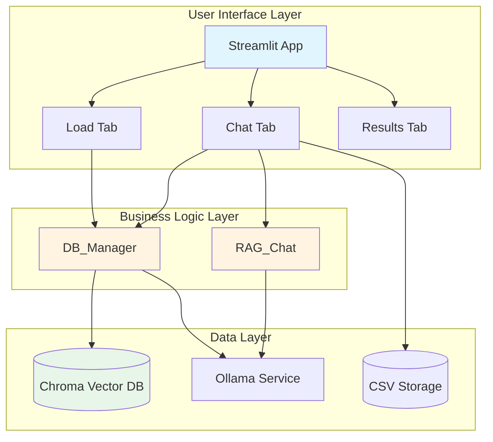

# Thesis Guidance Chat Application

> **Proof of Concept**: A Retrieval-Augmented Generation (RAG) system for providing AI-powered thesis guidance based on JAMK University's official documentation.

[](https://www.python.org/downloads/)
[](../LICENSE)

## 📋 Table of Contents

- [Overview](#overview)
- [Features](#features)
- [Architecture](#architecture)
- [Quick Start](#quick-start)
- [Documentation](#documentation)
- [Project Structure](#project-structure)
- [Contributing](#contributing)
- [License](#license)

## 🎯 Overview

**This is a Proof of Concept (PoC)** demonstrating the feasibility and effectiveness of using RAG technology for academic guidance.

The Thesis Guidance Chat Application is a specialized RAG system designed to help students with thesis writing by providing accurate, document-grounded responses based on JAMK University's official thesis guidance materials. The system ensures responses are strictly based on loaded documents, preventing hallucination and maintaining academic accuracy.

### PoC Objectives

This proof of concept demonstrates:
- **Technical Feasibility**: Integration of vector databases, LLMs, and document processing
- **RAG Effectiveness**: Retrieval-augmented generation for academic content
- **User Experience**: Streamlit-based interface for educational AI assistants
- **Local Deployment**: Running LLMs locally with Ollama for privacy and cost-effectiveness
- **Document Grounding**: Strict adherence to source materials to prevent hallucination

### PoC Scope and Limitations

**In Scope**:
- Core RAG functionality (retrieval + generation)
- Document loading and processing (HTML, PDF)
- Vector database integration
- Basic web UI for interaction
- Configuration management
- Session tracking

**Out of Scope** (for PoC):
- Production-grade security and authentication
- High-availability and scalability
- Comprehensive monitoring and alerting
- Multi-user support with user management
- Advanced analytics and reporting
- Data privacy compliance (GDPR, etc.)
- Extensive automated testing

### Key Capabilities

- **Document-Grounded Responses**: All answers are strictly based on loaded JAMK thesis guidance documents
- **Multi-Format Support**: Processes both HTML web pages and PDF documents
- **Semantic Search**: Uses vector embeddings for intelligent document retrieval
- **Multiple LLM Models**: Supports Llama, Phi3, and Qwen models via Ollama
- **Session Tracking**: Stores chat history for analysis and review

## ✨ Features

### Core Features

- 🔍 **Semantic Document Retrieval**: Vector-based similarity search using Chroma DB
- 🤖 **RAG Chat Interface**: Context-aware responses using local LLM models
- 📚 **Multi-Source Loading**: Automatic scraping and processing of JAMK web pages and PDFs
- 💾 **Persistent Storage**: Vector database and CSV-based chat history
- 🎨 **User-Friendly UI**: Streamlit-based web interface with tabbed navigation
- ⚙️ **Configurable**: YAML-based configuration for easy customization

### Technical Features

- **Strict Context Adherence**: Comprehensive prompt engineering to prevent hallucination
- **Chunking Strategy**: Sentence-aware text splitting for optimal retrieval
- **Metadata Management**: Tracks source URLs, content types, and page numbers
- **Error Handling**: Robust error handling with detailed logging
- **Memory Management**: Automatic garbage collection for long-running sessions

## 🏗️ Architecture

The application follows a 3-tier architecture with clear separation of concerns:



For detailed architecture documentation, see [Architecture Guide](ARCHITECTURE.md).

## 🚀 Quick Start

### Prerequisites

- Python 3.12 or higher
- [Ollama](https://ollama.ai/) installed and running
- Required Ollama models pulled:
  ```bash
  ollama pull llama3.2:latest
  ollama pull mxbai-embed-large
  ```

### Installation

1. **Clone the repository**
   ```bash
   git clone https://github.com/jv-mt/rag_chat.git
   cd rag_chat
   ```

2. **Set up virtual environment using uv**
   ```bash
   # Install uv if not already installed
   curl -LsSf https://astral.sh/uv/install.sh | sh
   
   # Create and activate virtual environment
   uv venv
   source .venv/bin/activate  # On Windows: .venv\Scripts\activate
   ```

3. **Install dependencies**
   ```bash
   uv pip install -r requirements.txt
   ```

4. **Verify Ollama is running**
   ```bash
   curl http://localhost:11434/api/tags
   ```

### Running the Application

```bash
streamlit run src/app.py
```

The application will open in your default browser at `http://localhost:8501`.

### First-Time Setup

1. **Load Documents**: Navigate to the "Load" tab and click "Submit" to load JAMK thesis guidance documents
2. **Wait for Processing**: The system will process ~40 URLs (takes 5-10 minutes)
3. **Start Chatting**: Once loaded, go to the "Retrieve" tab and start asking questions

## 📚 Documentation

Comprehensive documentation is available in the `docs/` directory:

- **[Architecture Guide](ARCHITECTURE.md)** - Detailed system architecture and component interactions
- **[API Reference](API.md)** - Complete API documentation for all modules
- **[Configuration Guide](CONFIGURATION.md)** - Configuration options and customization
- **[Development Guide](DEVELOPMENT.md)** - Setup for contributors and developers
- **[User Guide](USER_GUIDE.md)** - End-user documentation and tutorials
- **[Deployment Guide](DEPLOYMENT.md)** - Production deployment instructions

## 📁 Project Structure

```
rag_chat/
├── src/                      # Source code
│   ├── app.py               # Streamlit web interface
│   ├── chat.py              # RAG chat implementation
│   ├── db_manager.py        # Vector database manager
│   └── tg_logger.py         # Logging configuration
├── configs/                  # Configuration files
│   ├── settings.yml         # Application settings
│   └── logger_config.yml    # Logging configuration
├── docs/                     # Documentation
│   ├── README.md            # This file
│   ├── ARCHITECTURE.md      # Architecture documentation
│   ├── API.md               # API reference
│   └── ...                  # Additional guides
├── chroma_db/               # Vector database storage
├── chat_session_records/    # Chat history CSV files
├── logs/                    # Application logs
├── requirements.txt         # Python dependencies
└── README.md               # Project README
```

## 🤝 Contributing

Contributions are welcome! Please see our [Development Guide](DEVELOPMENT.md) for details on:

- Setting up the development environment
- Code style and standards
- Manual verification procedures
- Submitting pull requests

## 📄 License

This project is licensed under the MIT License - see the [LICENSE](../LICENSE) file for details.

## 🙏 Acknowledgments

- **JAMK University of Applied Sciences** for thesis guidance documentation
- **LangChain** for RAG framework
- **Ollama** for local LLM inference
- **Chroma** for vector database

## 📞 Support

For questions or issues:

- Open an issue on [GitHub](https://github.com/jv-mt/rag_chat/issues)
- Check the [User Guide](USER_GUIDE.md) for common questions
- Review the [API Reference](API.md) for technical details

---

**Author**: Jukka Veijanen  
**Version**: 1.0.0  
**Last Updated**: 2025-10-29

