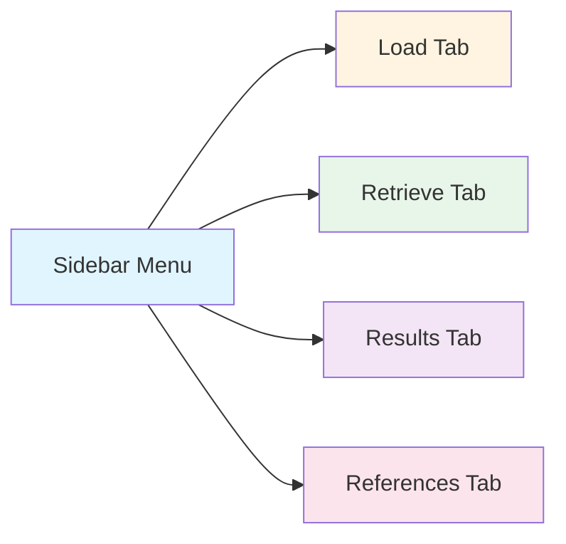
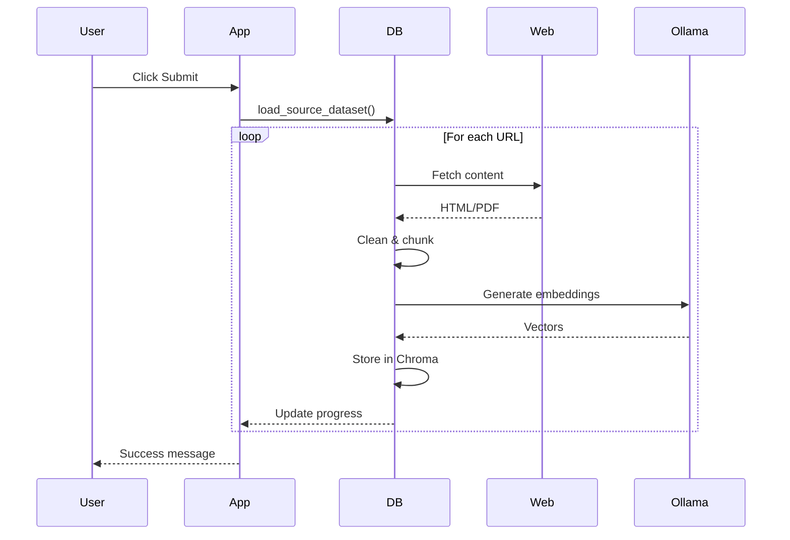

# User Guide

Complete guide for using the Thesis Guidance Chat Application.

> **Note**: This is a Proof of Concept (PoC) system. While functional, it is designed to demonstrate the feasibility of RAG-based thesis guidance rather than serve as a production-ready application.

## Table of Contents

- [Getting Started](#getting-started)
- [Loading Documents](#loading-documents)
- [Asking Questions](#asking-questions)
- [Viewing Results](#viewing-results)
- [Best Practices](#best-practices)
- [Troubleshooting](#troubleshooting)
- [FAQ](#faq)

## Getting Started

### Prerequisites

Before using the application, ensure:

1. ✅ Ollama is installed and running
2. ✅ Required models are downloaded
3. ✅ Application is installed and configured

### Verify Ollama

```bash
# Check Ollama is running
curl http://localhost:11434/api/tags

# Should return JSON with available models
```

### Start the Application

```bash
# Activate virtual environment
source .venv/bin/activate

# Run Streamlit app
streamlit run src/app.py
```

The application opens at `http://localhost:8501`.

## Application Interface

The application has four main tabs accessible from the sidebar:



### Sidebar

- **Choose Action**: Select which tab to view
- **Select a chat model**: Choose LLM model (Llama, Phi3, Qwen)

## Loading Documents

**First-time setup required**: Load JAMK thesis guidance documents before asking questions.

### Step-by-Step

1. **Navigate to Load Tab**
   - Click "Load" in the sidebar menu

2. **Review URLs**
   - The page shows configured JAMK URLs
   - ~40 URLs including HTML pages and PDFs

3. **Click Submit**
   - Starts the loading process
   - Progress bar shows completion status
   - Currently processing URL is displayed

4. **Wait for Completion**
   - Takes 5-10 minutes for all URLs
   - Success message appears when done

### What Happens During Loading



### Loading Progress

The interface shows:
- **Progress bar**: Overall completion percentage
- **Current URL**: Which document is being processed
- **Recent URLs**: Last 6 processed URLs

### Troubleshooting Loading

**Problem**: Timeout errors

**Solution**:
```yaml
# Increase timeout in configs/settings.yml
network:
  request_timeout: 60  # Increase from 30
```

**Problem**: "No chunks" error

**Cause**: URL content couldn't be processed

**Solution**: Check logs in `logs/` directory for details

## Asking Questions

Once documents are loaded, you can ask questions about thesis writing.

### Step-by-Step

1. **Navigate to Retrieve Tab**
   - Click "Retrieve" in sidebar
   - Select "Chat" sub-tab

2. **Enter Your Question**
   - Type question in text input box
   - Be specific and clear

3. **Click Submit**
   - System retrieves relevant documents
   - Generates response using LLM

4. **Review Response**
   - Response appears below input
   - Retrieved documents shown with sources
   - Relevance scores displayed

### Question Examples

#### ✅ Good Questions

**Specific and focused**:
```
How long should a bachelor's thesis introduction be?
What are the assessment criteria for master's thesis?
How do I cite sources in JAMK format?
What is the thesis submission process?
```

**Process-oriented**:
```
What steps do I need to complete before starting my thesis?
How do I create a data management plan?
What is the plagiarism check procedure?
```

#### ❌ Poor Questions

**Too vague**:
```
Tell me about thesis
How do I write?
```

**Outside scope**:
```
What's the weather like?
How do I register for courses?
```

**Asking for opinions**:
```
What's the best thesis topic?
Should I choose qualitative or quantitative research?
```

### Understanding Responses

Each response includes:

1. **Answer**: LLM-generated response based on documents
2. **Duration**: Response time in seconds
3. **Metadata**: Model info, token counts
4. **Retrieved Documents**: Source documents with:
   - Document content
   - Source URL
   - Relevance score (lower = more relevant)

### Response Quality

The system is designed to:
- ✅ Only use information from loaded documents
- ✅ Cite sources implicitly through retrieved docs
- ✅ Refuse to answer if information not available
- ❌ Never hallucinate or invent information

**Example - No Information Available**:

```
Question: What is the thesis deadline for spring 2025?

Response: I do not have enough information to answer 
this question based on the provided sources.
```

## Viewing Results

All chat interactions are saved for review and analysis.

### Accessing Results

1. **Navigate to Retrieve Tab**
2. **Select "Results" sub-tab**
3. **View DataFrame** with all chat history

### Results Table

| Column | Description |
|--------|-------------|
| timestamp | When the question was asked |
| duration | Response time (seconds) |
| model | Which LLM model was used |
| query | Your question |
| response | LLM's answer |
| metadata | Technical details (JSON) |
| documents | Retrieved documents (JSON) |

### Filtering and Sorting

Streamlit DataFrame features:
- **Sort**: Click column headers
- **Filter**: Use search box
- **Expand**: Click cells to see full content

### Exporting Results

Results are automatically saved to:
```
chat_session_records/chat_results.csv
```

**Export for analysis**:
```python
import pandas as pd

# Load results
df = pd.read_csv('chat_session_records/chat_results.csv')

# Filter by model
llama_results = df[df['model'] == 'llama3.2:latest']

# Analyze response times
avg_duration = df['duration'].mean()
print(f"Average response time: {avg_duration:.2f}s")
```

## Best Practices

### Asking Effective Questions

1. **Be Specific**
   - ✅ "What are the page requirements for bachelor's thesis?"
   - ❌ "Tell me about thesis requirements"

2. **One Topic Per Question**
   - ✅ "How do I format citations?"
   - ❌ "How do I format citations and what's the deadline and who's my supervisor?"

3. **Use Keywords from Domain**
   - ✅ "thesis", "bachelor's", "master's", "assessment", "submission"
   - Helps retrieval find relevant documents

4. **Follow-up Questions**
   - Ask related questions to explore topic
   - Each question is independent (no conversation memory)

### Model Selection

Choose model based on needs:

| Model | Speed | Quality | Use Case |
|-------|-------|---------|----------|
| **llama3.2:latest** | Medium | High | Default, best quality |
| **phi3:latest** | Fast | Good | Quick answers |
| **qwen3:4b** | Fast | Good | Alternative |

**Recommendation**: Use `llama3.2:latest` for important questions.

### Performance Tips

1. **First Query is Slower**
   - Model loading takes time
   - Subsequent queries are faster

2. **Shorter Questions**
   - Faster processing
   - More focused responses

3. **Review Retrieved Documents**
   - Check if relevant documents were found
   - Low scores (< 0.5) indicate good matches

## Troubleshooting

### Common Issues

#### "Vector database collection not initialized"

**Cause**: Documents not loaded yet

**Solution**: Go to Load tab and load documents first

---

#### No Response / Timeout

**Cause**: Ollama not running or model not loaded

**Solution**:
```bash
# Check Ollama status
curl http://localhost:11434/api/tags

# Restart Ollama if needed
systemctl restart ollama  # Linux
# or restart Ollama app on macOS/Windows

# Pull model if missing
ollama pull llama3.2:latest
```

---

#### "No documents found"

**Cause**: Query didn't match any documents

**Solution**:
- Rephrase question with different keywords
- Check if documents are loaded (Load tab)
- Verify question is about thesis guidance

---

#### Slow Performance

**Causes**:
- Large number of documents
- Complex query
- System resources

**Solutions**:
```yaml
# Reduce k in configs/settings.yml
database:
  default_k: 2  # Retrieve fewer documents

# Use faster model
models:
  default_model: "phi3:latest"
```

---

#### Incorrect Responses

**Cause**: Retrieved documents not relevant

**Solution**:
- Check retrieved documents section
- Rephrase question for better retrieval
- Verify source documents contain answer

## FAQ

### General Questions

**Q: Do I need internet connection?**

A: Only for initial document loading from JAMK websites. After loading, the app works offline (except Ollama needs to run locally).

---

**Q: Can I add my own documents?**

A: Yes, add URLs to `configs/settings.yml`:
```yaml
data_sources:
  urls:
    - "https://your-document-url.pdf"
```

---

**Q: How much disk space is needed?**

A: 
- Vector database: ~100-500 MB (depends on documents)
- Ollama models: ~2-3 GB per model
- Chat results: Minimal (~1 MB per 1000 chats)

---

**Q: Can multiple users use the app simultaneously?**

A: Current version is single-user (Streamlit session-based). For multi-user, deploy with proper session management.

---

### Technical Questions

**Q: Which embedding model is best?**

A: `mxbai-embed-large` (default) provides best quality. For faster performance, use `nomic-embed-text`.

---

**Q: How do I change the prompt template?**

A: Edit `configs/settings.yml`:
```yaml
chat:
  prompt_template: |
    Your custom prompt here...
    Documents: {content}
    Question: {question}
```

---

**Q: Can I use OpenAI instead of Ollama?**

A: Not currently supported. The app is designed for local Ollama models. See [Development Guide](DEVELOPMENT.md) for extending to other LLM providers.

---

**Q: How do I clear the vector database?**

A: Delete the database directory:
```bash
rm -rf chroma_db/
```
Then reload documents from Load tab.

---

**Q: Where are logs stored?**

A: In `logs/` directory with daily rotation:
```
logs/tg_logger_2025-10-29.log
```

---

## Next Steps

- **Advanced Configuration**: See [Configuration Guide](CONFIGURATION.md)
- **API Usage**: See [API Reference](API.md)
- **Development**: See [Development Guide](DEVELOPMENT.md)

---

**Need Help?**

- Check logs in `logs/` directory
- Review [Troubleshooting](#troubleshooting) section
- Open issue on GitHub

